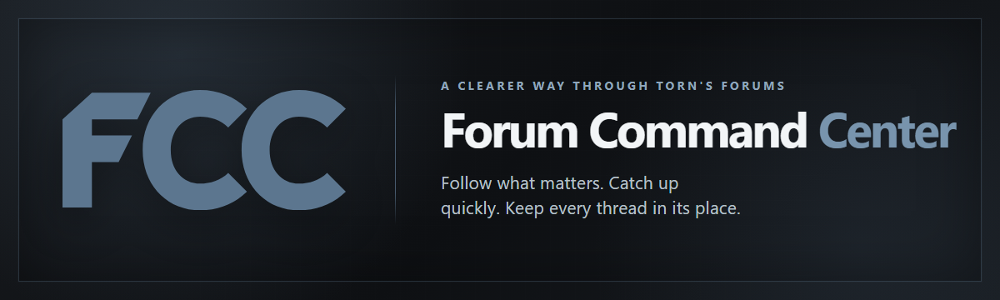
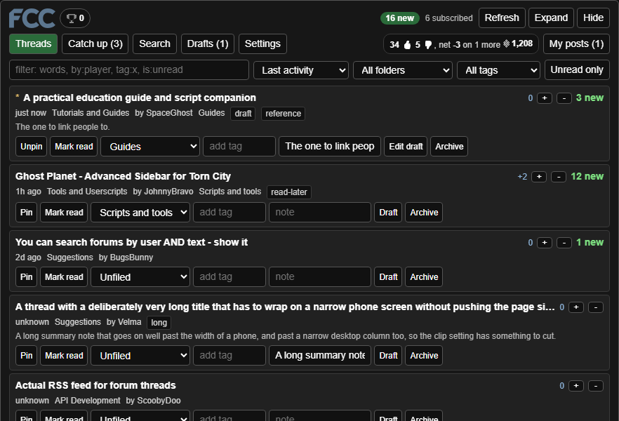
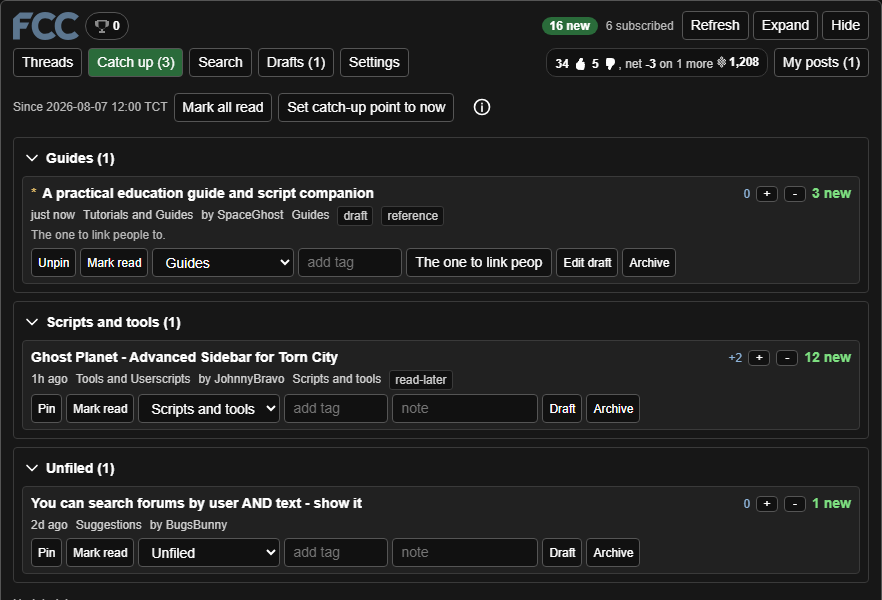
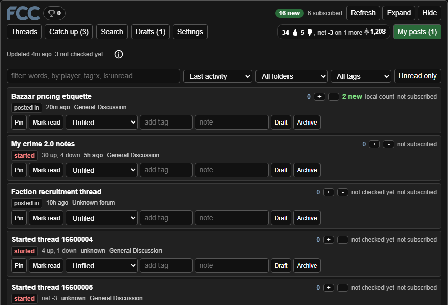
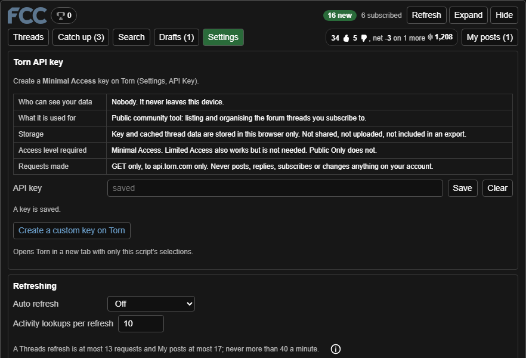
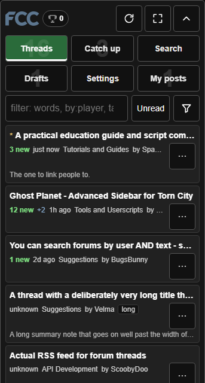
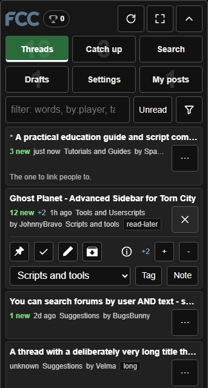
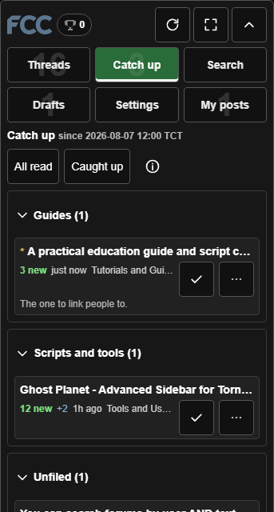
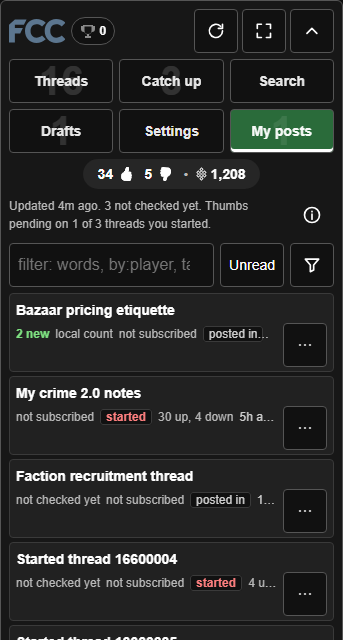

<p align="center">
  
</p>

# Torn Forum Command Center

Forum Command Center, or FCC, turns Torn's small subscribed-threads box into a full forum workspace. It runs on the forums page in desktop Tampermonkey and Torn PDA, using Torn's official API to organize followed threads, show what is new, preserve reply drafts, and search discussions you care about.

FCC is read-only. It does not post, reply, vote, subscribe, unsubscribe, or automate gameplay. Its folders, tags, notes, drafts, read markers, badges, and settings stay on your device.

## Screenshots

<p align="center">
  
  
  
  
</p>

<p align="center">
  
  
  
  
</p>

## Features

### A complete forum workspace

- **Threads** brings subscribed and manually organized threads into one sortable, filterable list.
- **Catch up** shows new activity since your catch-up point, grouped by folder.
- **My posts** lists threads you started or posted in, whether or not you follow them.
- **Search** covers thread metadata and can search cached post bodies.
- **Drafts** collects saved replies.
- **Settings** holds the API key, refresh, appearance, folders, backup, storage, and badge controls.
- Sort by activity, unread status, personal priority, title, author, forum, or recently added. Pinned threads stay first.
- Filter by folder, tag, unread state, or query.
- Rows shown can cap Threads, Catch up, and My posts. Search and Drafts remain uncapped, and Expand shows every row.

### Folders, tags, and personal organization

- Create and reorder folders, including the built-in **Unfiled** group.
- Let a folder claim one or more forums. New subscriptions from a claimed forum file themselves automatically; filing a thread by hand always wins.
- A forum can belong to only one folder. Removing a claim affects future filing and does not move threads already filed.
- Folders organize only threads you subscribe to or file by hand. They never add every thread from a forum.
- Catch up follows the folder order, and each group can be collapsed.
- Add tags and private notes, pin threads, set personal priority, and archive or unarchive without deleting local work.

### Read, unread, and Catch up

- Subscribed-thread unread counts come from Torn.
- Mark read is a local dismissal. It cannot clear Torn's own new-post counter; opening the thread on Torn does that.
- **Mark all read** clears the current Catch up list locally.
- **Set catch-up point to now** establishes where the next Catch up begins.
- Optional author-only mode treats a thread as new only when its author posts. This is useful for guides, scripts, and announcement threads.
- My posts uses Torn's unread value for started threads when available. Posted-in threads without a Torn count receive a clearly labelled local count.

### Drafts and search

- Save reply drafts on the device and insert them into Torn's reply box.
- Reply-box autosave is enabled by default and can be disabled.
- If the reply box cannot be found, FCC offers Copy instead of silently failing.
- Search titles, authors, forums, tags, and notes.
- Deep search fetches post bodies for selected threads and caches them locally. It covers up to five fetched pages per thread.
- Queries support bare words, quoted phrases, author, tag, folder, unread, pinned, and draft filters, with negation.
- **Search on Torn** sends the query to Torn's own forum search through an ordinary link.

### The Drafts editor

Drafts is a post editor. Drafts stay on the device, and you press Torn's Post
button yourself.

- **Modes.** A pill switches between Text, MD (Markdown), HTML and Preview,
  one pane at a time. Switching converts the draft without losing anything. A
  draft over 20000 characters is never cut: an action that would pass the
  limit is refused with a notice.
- **Preview** shows the post the way Torn will, in Torn's light or dark theme
  (the switch is in the Preview bar). Tapping anywhere in the Preview, on a
  paragraph, its text or the empty area, returns to the source mode at that
  spot. Images in Preview stay as placeholders until you tap
  Show images, so the panel does not contact image hosts on its own.
- **Toolbar.** Bold, italic, underline, strike, Torn's 17 text colors or a
  custom color, size, alignment, quote, link, image, table, emoji (Torn's own
  and Unicode) and a Markdown help card. The buttons are symbols (B, I, U, S,
  A with a color bar, aA, an align glyph, a quote mark, a link, a picture, a
  table, a smiley, ?, and a curved arrow for Undo); each keeps its full name
  as its tooltip and screen-reader label. On a narrow panel it shows Undo, B,
  I, U, Color, Link and More in one right-aligned row; More opens the rest.
  A custom color is only questioned when it is nearly invisible on Torn's
  light or dark theme.
- **Markdown marks.**

| You type | You get |
|---|---|
| `**bold**` | bold |
| `*italic*` | italic |
| `++underline++` | underline |
| `~~strike~~` | strike through |
| `{red}text{/}` | a Torn color (red, pink, grape, violet, indigo, blue, cyan, teal, green, lime, yellow, orange, gray1 to gray5) |
| `{#ff8800}text{/}` | any color |
| `{18}text{/}` | text size, 8 to 36 |
| `# Title` | a big bold line (`##` and `###` are smaller) |
| `:::center` | center the lines up to the next `:::` |
| `> text` | a quote |
| `- item` | a list (`1.` for numbers) |
| `[text](link address)` | a link (https only) |
| `` | an image |
| `:grin:` | a Torn emoji |
| `\| a \| b \|` | a table row; a `---` row under the first makes it a header |
| `\*` | a literal mark character |

- **Enter and blank lines.** Enter starts a new paragraph, an empty line adds
  a gap, in every mode, with no markup to learn. In HTML mode a line of text
  outside a tag is a paragraph; Enter inside `<p ...>` splits it and keeps
  its alignment, Enter inside `<li>` starts a new item, and Shift+Enter is a
  line break (`<br>`). Inside an open list, table or quote a new line is only
  a space, so a list can be typed over several lines. In Markdown, Enter on a
  `- item`, `1. item` or `> quote` line continues the list or quote, and
  Enter on a line holding only the marker ends it.
- **Help key.** The `?` button opens a compact key of what you type and what
  you get, for the current mode (Markdown or HTML). While it is open the
  button reads `X` and the picker's bottom button reads Close.
- **Selection and alignment.** Bold, Quote, Align and the other tools act on
  the range you highlighted, and on a phone you can tap to place the caret or
  drag the selection handles first. Align and Quote cover every selected line.
  Aligning anywhere in a table aligns the whole table; a Markdown table needs
  a header row (the `---` row) to hold alignment, otherwise the editor says
  so and changes nothing.
- **Undo.** The first toolbar button, also shown in Text mode. It restores the
  previous text, mode and selection, including after a mode switch. Typing is
  one step per burst, the last 50 steps are kept, and they are cleared when
  you open another draft. There is no Redo.
- **Save as free draft.** On a thread draft, copies what is in the editor
  into a new free draft ("Untitled N") and opens it. The thread's own saved
  draft is left as it was.
- **Editor height.** Drag the corner of the box to resize it; it keeps that
  height until you open another draft. Settings has "Editor height (desktop)"
  and "Editor height (phone)": Small, Medium, Large or Extra large (Small is
  the old height). Desktop defaults to Large, phone to Medium.
- **One message at a time.** A new status message replaces the previous one,
  and messages clear when you open another thread, forum page or panel view,
  or leave the page. If a save fails, its error stays: the same action's
  success message never replaces it.
- **Drafts info.** The `i` button beside "Draft for this thread" (or beside
  a free draft's name) explains thread drafts, free drafts, Save, Insert,
  Copy and autosave.
- **Free drafts.** **+ New draft** creates a named draft tied to no thread,
  such as a new thread's opening post. All drafts lists both kinds.
- **Insert and Copy.** Insert into reply box adds the formatted post to the end
  of Torn's editor and never replaces what is already there. If the editor
  cannot be found, FCC offers Copy. Copy puts the formatted post on the
  clipboard; pasted into Torn's editor it keeps its styles.
- **Image link fixer.** Paste a Google Drive, Dropbox, GitHub, Giphy, Gyazo,
  Imgur or Reddit link and the editor rewrites it into a link Torn can show.
  Google Photos, OneDrive, ImgBB, Postimages, Imgur albums, Lightshot and Tenor
  cannot be rewritten, so the editor says how to copy the direct image address.
  Discord links expire and plain http links are refused, and unsafe hosts are
  refused.
  Open it with **Fix image link** at the right end of the Save / Insert /
  Delete row. The section checks one link (shows the converted link, a
  thumbnail loaded only after you press Check, **Copy link** and **Insert into
  draft**), and **Fix all links in this draft** rewrites every image link in
  the draft. In Markdown and HTML, a fixable link that stands alone on its own
  line, such as a Drive "view" link pasted by itself, becomes an image. A link
  in the middle of a sentence or inside link markup is left as a link, and the
  message says how many were left. Nothing is uploaded.
- **Default editor.** In Settings, "Default editor for new drafts": Markdown
  (the default), HTML or Text. It applies to new drafts only.

### Reactions, karma, and badges

- My posts checks the opening posts of started threads for thumbs up and thumbs down.
- Until a thread has been checked, Torn's thread rating is displayed only as **net**. The project does not assume whether that source value means net reactions or likes alone.
- The reactions display also shows forum karma.
- Fifteen local badges cover setup, organization, focused thread visits, explored forums, backlog clearing, and Catch up streaks.
- Badge streaks use TCT/UTC days. Badges make no API request of their own.
- Badge progress can be disabled, exported, imported, or reset.

### Appearance and mobile layout

- Choose **Match Torn** (the default), **Dark**, or **Light**.
- Optionally hide the panel when opening one of FCC's thread links.
- Clip long titles and summaries to one line, with the full content available through the row's expanded actions on narrow panels.
- The see-through option uses translucent panel and row backgrounds. Expand remains solid.
- On narrow panels:
  - the icon header scales to remain on one line;
  - the views form a compact navigation grid with accessible counts;
  - filters move behind a Filters control;
  - each row has a drawer for pin, read, draft, archive, priority, folder, tag, and note actions;
  - tag and note controls use small in-panel editors;
  - info buttons explain controls without permanently occupying the screen.

### Backup and diagnostics

- Export folders, order, forum claims, tags, pins, priorities, notes, read markers, drafts, and badges as one portable string.
- The API key and post cache are never exported.
- Import is additive and reports what it added. Invalid data is refused without altering the workspace.
- The debug report excludes the API key, drafts, notes, post text, thread titles, and thread IDs.
- Auto refresh is off by default and pauses while the page is hidden or the window is unfocused.

## Install

### Desktop with Tampermonkey

1. Install [Tampermonkey](https://www.tampermonkey.net/).
2. Install [Torn Forum Command Center from Greasy Fork](https://greasyfork.org/en/scripts/599453-torn-forum-command-center).
3. Visit [Torn Forums](https://www.torn.com/forums.php).
4. Open FCC's **Settings** view and add the API key described below.

### Torn PDA

1. Add the same userscript through Torn PDA's userscript manager, using the Greasy Fork listing: https://greasyfork.org/en/scripts/599453-torn-forum-command-center.
2. Set its injection time to **END**.
3. Open Torn's forums in the app.
4. Open FCC's **Settings** view and add the API key.

There is no separate mobile build. Torn PDA and desktop Tampermonkey run the same userscript.

## API key

FCC requires a **Minimal Access** Torn API key. Limited Access also works but is unnecessary, while Public Only does not provide the required subscribed-thread selections. Do not give FCC a Full Access key.

In FCC's Settings, select **Create a custom key on Torn**. This is a normal link to Torn's key page and pre-fills the least-privilege selections used by the script. Torn creates nothing until you confirm it there, and no key is placed in the link.

The selections are:

- `user`: `forumsubscribedthreads`, `forumfeed`, `forumthreads`, `forumposts`, `profile`
- `forum`: `categories`, `thread`, `posts`

Paste the confirmed key back into FCC and save it.

The key is stored in userscript storage on that device, masked in the panel, excluded from exports, and removed from copied errors and debug reports.

## Settings overview

### API key

Shows the required access level, who can see the stored data, what FCC uses it for, where it is stored, and the requests FCC makes.

### Refreshing

Controls optional auto refresh, activity lookups, and author-only new-post tracking.

At the default activity-lookup setting:

- a Threads refresh is at most 13 requests;
- a My posts refresh is at most 17 requests;
- the rate limiter permits no more than 40 requests in a rolling minute.

My posts refreshes on opening at most once every 15 minutes unless Refresh is pressed. Auto refresh is disabled by default.

### Appearance

Controls the theme, Rows shown, opening-thread auto-hide, line clipping, and the see-through background.

### Folders

Creates, reorders, and deletes user folders; moves Unfiled; and manages each folder's forum claims. Deleting a folder unfiles its threads but preserves their tags and notes.

### Backup, storage, and badges

Exports or imports the workspace, reports post-cache size, clears cached posts, creates the debug report, resets local data, and manages the badge catalogue.

## Privacy and safety

- FCC runs only on `forums.php`, with a runtime scope check because Torn PDA can ignore userscript `@match` metadata.
- It requests only `GM_getValue`, `GM_setValue`, and `GM_xmlhttpRequest`.
- Its only allowed connection host is `api.torn.com`.
- Every network request is a GET. There are no POST, PUT, or DELETE requests, no third-party requests, and no telemetry.
- FCC does not scrape Torn forum pages. Route capture uses the current address and page title; draft support reads the reply box on the page you are viewing, and the Match Torn theme (the default) reads the page background color.
- The script does not simulate account actions, submit forms, open windows, or navigate on its own. Inserting a draft stops at the reply box; the player presses Torn's Post button.
- Auto refresh stops while the page is hidden or the window is unfocused.
- A refused or invalid key is disabled instead of being retried repeatedly.
- Local folders, tags, notes, drafts, read state, badges, and settings remain in userscript storage.
- Clearing normal Torn site data does not clear userscript storage, but removing the userscript can.
- Export never includes the key or post cache.

See [`docs/rules-compliance.md`](docs/rules-compliance.md) for the clause-by-clause review of Torn's scripting and API rules.

## Limitations

- Mark read cannot clear Torn's own unread counter.
- A userscript cannot notify you while the browser or app is closed.
- Read state does not automatically sync between devices; export and import can move it.
- `forumsubscribedthreads` has no last-activity timestamp, so FCC resolves activity from several sources. An unresolved time is shown as unknown rather than guessed.
- Deep search covers fetched pages, not every page of a very long thread.
- Draft insertion depends on Torn's reply box remaining discoverable. Copy remains available when it is not.
- Torn's API does not expose a subscriber count, so FCC does not display one.

## Development

Requires Node.js and no runtime or development dependencies.

```text
npm test
npm run test:syntax
npm run verify:forum
node tests/mutation-check.mjs > mutation-check.log 2>&1
```

Read the complete mutation report from `mutation-check.log`. Do not pipe the mutation check into `head`: it deliberately edits the userscript during each mutation and restores it, including when interrupted.

Release remains blocked on [`docs/qa-checklist.md`](docs/qa-checklist.md), which must be completed against a signed-in Torn account and real Torn PDA and desktop environments.

### Code map

- `torn-forum-command-center.user.js`
  - **Engine**: pure normalisation, merging, unread state, sorting, queries, search, export/import, and badge rules.
  - **Runtime**: storage, API transport, rate limiting, capture, rendering, and lifecycle integration.
- `tests/load-userscript.js`: reads the userscript, adds test exports in memory, and executes it in a mocked VM context without modifying the source file.
- `tests/*.test.js`: Node-only contract and regression tests.
- `tests/mutation-check.mjs`: intentionally mutates promises one at a time and confirms that tests detect each break.
- `tests/render-preview.mjs`: produces standalone visual previews.
- `docs/architecture.md`: current design, data flow, constraints, and endpoint map.
- `docs/qa-checklist.md`: real-device and live-API release checks.
- `docs/rules-compliance.md`: Torn rule and API-term review.

### Do not read the userscript whole

The userscript is intentionally organized around marked Engine and Runtime sections. Do not dump the entire file into a review or assistant context.

Use targeted searches first, then read only the relevant function or marked section. For example:

```text
rg -n "CUSTOM_KEY_SELECTIONS|VIEWS|BADGES|REQUESTS_PER_WINDOW" torn-forum-command-center.user.js
rg -n "ENGINE START|RUNTIME START|renderSettingsView|buildPanelModel" torn-forum-command-center.user.js
```

Tests should continue to load the source through `tests/load-userscript.js`; they must not rewrite the production userscript on disk. The mutation check is the deliberate exception and must restore the file.

## License

MIT. See [`LICENSE`](LICENSE).

The drawer's Archive icon is UXWing's [archive files icon](https://uxwing.com/archive-files-icon/), used under the UXWing license. That license permits commercial use and does not require attribution; the project credits it here anyway.
